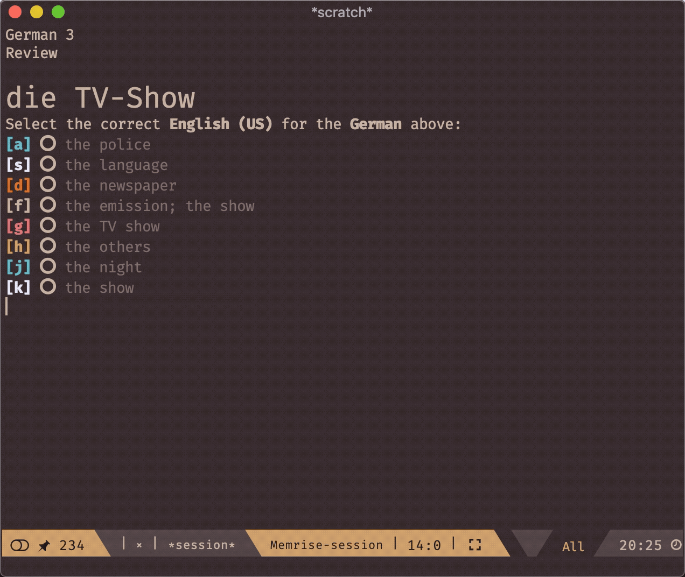
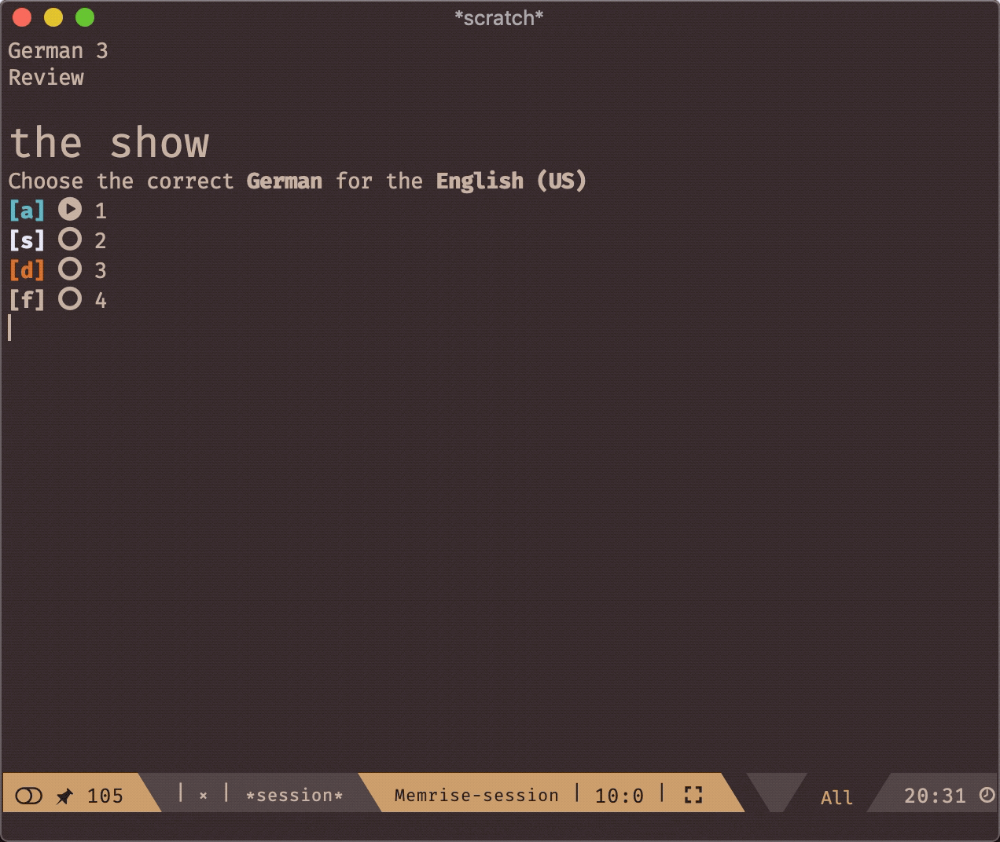
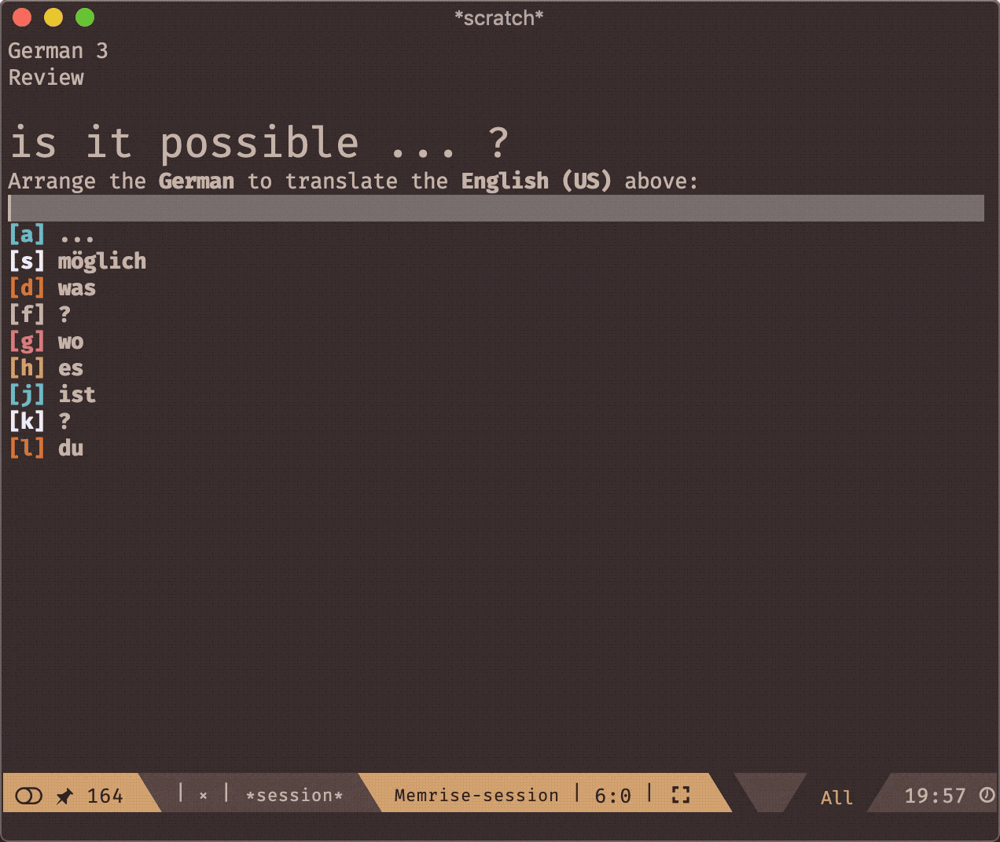
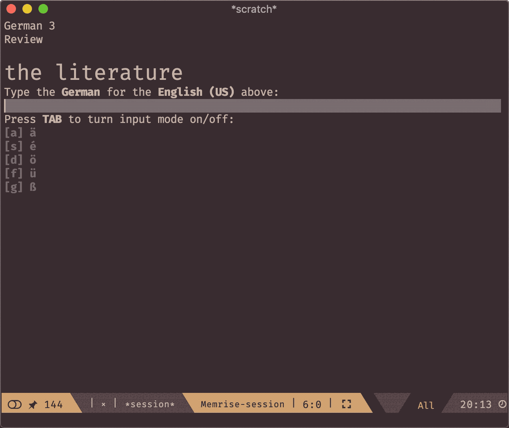

# memrise.el [](https://travis-ci.org/SavchenkoValeriy/memrise.el)

**Table of Contents**

- [Motivation](#motivation)
- [Installation](#installation)
    - [Installation from MELPA](#installation-from-melpa)
    - [Installation with Quelpa](#installation-with-quelpa)
    - [Manual installation](#manual-installation)
        - [use-package](#use-package)
        - [direct](#direct)
- [How to use](#how-to-use)
    - [Troubleshooting](#troubleshooting)
    - [Default bindings](#default-bindings)
    - [Customization](#customization)
- [Philosophy](#philosophy)
- [Roadmap](#roadmap)
- [Screenshots](#screenshots)
    - [Dashboard](#dashboard)
    - [Tests](#tests)
        - [Multi-choice test](#multi-choice-test)
        - [Audio test](#audio-test)
        - [Tapping test](#tapping-test)
        - [Typing test](#typing-test)
        - [Completion](#completion)
- [Demo](#demo)
- [Contribute](#contribute)
- [Alternatives](#alternatives)
- [License](#license)

## Motivation

I like to learn languages and among other things I use [Memrise](https://www.memrise.com "Memrise web site"). It is a great learning tool and I strongly prefer it to simple flash card systems. However, as a developer, I spend *way more* time in front of a desktop computer than on my phone. This makes **Memrise** app not as useful for me. The web version of **Memrise** even though is good and provides bindings, still lacks customizability. I believe that with a good browser extensions this problem is solvable, but this is not the way I chose to go.

I am an Emacs geek and I want everything to be in Emacs, especially something that I do on a regular basis. For this reason, **memrise.el** is born. It aims to be a full-blown **Memrise** integration for Emacs with all the features you like and some additional perks of it being inside of Emacs.

## Installation

### Installation from MELPA

**memrise.el** is not yet on MELPA, but I hope it will be soon, sorry for the inconvenience!

### Installation with Quelpa

[Quelpa](https://framagit.org/steckerhalter/quelpa "Quelpa") gives you an ability to install Emacs packages directly from remote git repos. I recommend using it with [quelpa-use-package](https://framagit.org/steckerhalter/quelpa-use-package#installation) if you already use [use-package](https://github.com/jwiegley/use-package).

Here how it's done:

``` emacs-lisp
(use-package memrise
  :quelpa (memrise
           :fetcher github
           :repo "SavchenkoValeriy/memrise.el"))
```

### Manual installation

**NOTE**: installing **memrise.el** manually you'll have to install all of it dependencies on your own

#### use-package

1. Clone the repo
2. Add the following code to your `init.el` file:

``` emacs-lisp
(use-package memrise
  :load-path "<path/to/my/cloned/memrise.el/directory>")
```

#### direct

1. Clone the repo
2. Add the following code to your `init.el` file:

``` emacs-lisp
(add-to-list 'load-path "<path/to/my/cloned/memrise.el/directory>")
(require 'memrise)
```

## How to use

Basically **memrise.el** has only one entry point: `memrise-dashboard`. If you are not logged in, it will ask for your user credentials and then proceed to the dashboard.

**NOTE**: **memrise.el** doesn't store your credentials in ANY form. Later authorization happens solely using cookies.

After that you can choose a course from the list of your courses and start either *review* or *learning* session.

### Troubleshooting

**memrise.el** is not a polished package yet, so there are a few problems that you might encounter:

#### I called memrise-dashboard, but nothing happened. It only created empty \*dashboard\* buffer.

There is a problem that I didn't really look at now and it is connected to asynchronous requests (Issue #30).

**Workaround**: `(setq memrise-sync-requests t)`

#### I called memrise-dashboard and it keeps asking me for my credentials.

**memrise.el** has a bug (issue #29) of not showing actual result of authentication. Probably credentials are incorrect, try them on [Memrise login page](https://www.memrise.com/login/).

#### I keep getting some weird symbols on the dashboard and during the session instead of icons and radio buttons

**memrise.el** uses [all-the-icons](https://github.com/domtronn/all-the-icons.el) that requires you to install its additional fonts. You can do it by running 

<kbd>M-x all-the-icons-install-fonts [RET]</kbd>

### Default bindings

**Memrise Dashboard**

| binding      | action                                        |
|:------------:|:---------------------------------------------:|
| <kbd>n</kbd> | Jump to the next course                       |
| <kbd>p</kbd> | Jump to the previous course                   |
| <kbd>r</kbd> | Review/water the current course               |
| <kbd>l</kbd> | Learn new words/phrases in the current course |
| <kbd>g</kbd> | Refresh the dashboard                         |

**Memrise Session**

| binding        | action                                            |
|:--------------:|:-------------------------------------------------:|
| <kbd>C-m</kbd> | Submit your answer                                |
| <kbd>C-'</kbd> | Pop up a completion prompt (if available)         |
| <kbd>C-r</kbd> | Replay the audio from the question (if available) |

Other bindings are explicitly displayed during the session.

### Customization

While providing some reasonable defaults, **memrise.el** tries to make everything customizable.

The main parameter that you might want to tweak is `memrise-session-length`, which is a number of tasks in one session or `nil` if you want to use all the tasks received from **Memrise**.

You can find more things to customize in two groups: **memrise** and **memrise-faces**. Run <kbd>M-x customize-group [RET] memrise [RET]</kbd> and see what we got there.

## Philosophy

**memrise.el** is designed for the educational purposes only. Its' developers and users should not consider it as a hack on **Memrise** and use it for any other purposes than learning. **Memrise** gives us a great platform to learn and share courses.

**memrise.el** tries to be as user-friendly as possible. We should make it equally useful to Emacs newcomers and hardcore users.

**memrise.el** should be customizable in ANY ways useful to its' users.

## Roadmap

- [x] Make a very first version that actually does the job
- [ ] Check it on a big variety of **Memrise** courses (especially very different from English)
- [ ] Support videos
- [ ] Support OAuth authentication
- [ ] Cover a bigger part of the code with tests
- [ ] Integrate typing tests with Emacs input methods and figure out the best way to learn a keyboard layouts of other languages

## Screenshots

Here is a few screenshots of differents parts of **memrise.el**

### Dashboard

It summarizes all the courses that the user studies at the moment.


### Tests

In this section, you can find short GIFs of how **Memrise** tests look like in **memrise.el**

#### Multi-choice test

In this category of tests, user must pick the only correct version from the given list of options.

<p align="center">
  
</p>

#### Audio test

Audio test asks user to pick the right audio for the given word or phrase.

<p align="center">
  
</p>

#### Tapping test

Tapping tests are similar to multi-choice tests as they provide a list of words to choose from, but in this case, user has to *compose* the right phrase using available words.

<p align="center">
  
</p>

#### Typing test

Typing test is the hardest, it asks user to type in the correct translation. All the required additional symbols are easily accessible.

<p align="center">
  
</p>

#### Completion

Sometimes fetching for the right option might take some time even when the user knows exactly what she is looking for. In this case, the user can use her completion system to find the option she needs. 

Check the demo for the mutli-choice test:

<p align="center">
  
</p>

...and for the tapping test:

<p align="center">
  
</p>

## Demo

You can find a short video of me doing some German here: https://www.youtube.com/watch?v=9BC875XHq0o

## Contribute

All contributions are most welcome!

Don't hesitate firing up new PRs if you have any questions, problems or ideas. If you want to get involved in the project more than that, please do! We have a [contributing](./CONTRIBUTING.md) guide to give you some information on that.

## Alternatives

* [pamparam](https://github.com/abo-abo/pamparam)
* [org-drill](https://orgmode.org/worg/org-contrib/org-drill.html)

## License

The source code of the package is published under the [GPL-3.0](./LICENSE) license.

**memrise.el** and any of its' maintainers are in no way associated with or endorsed by **Memrise**.
