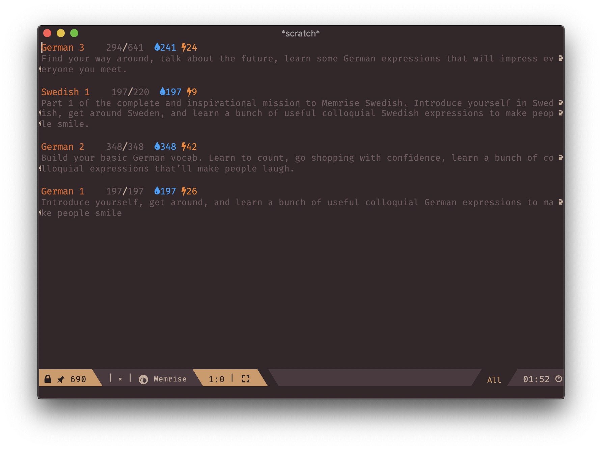
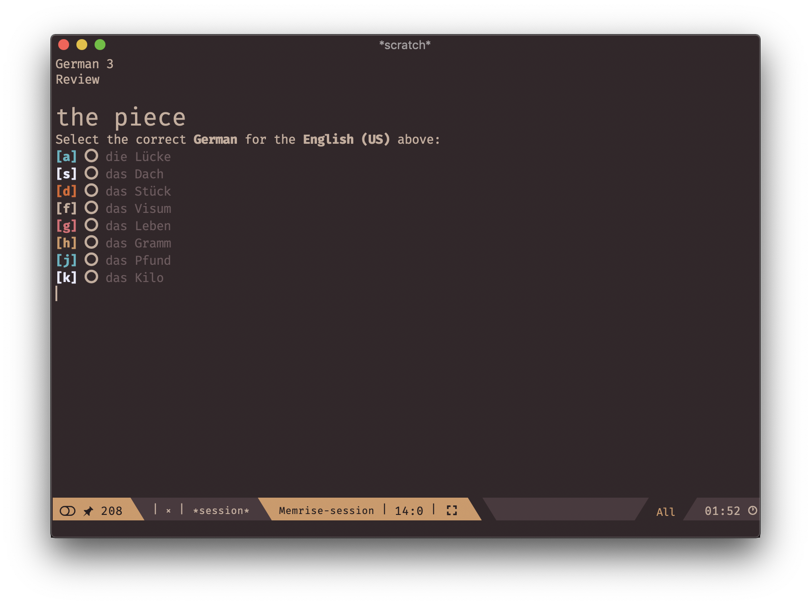
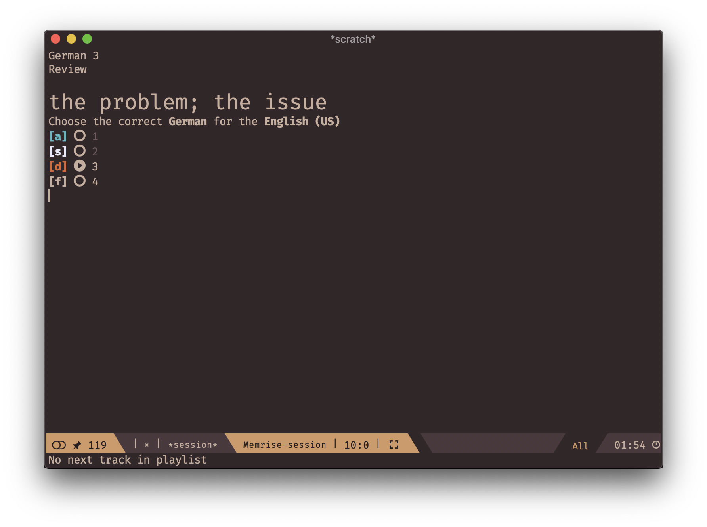
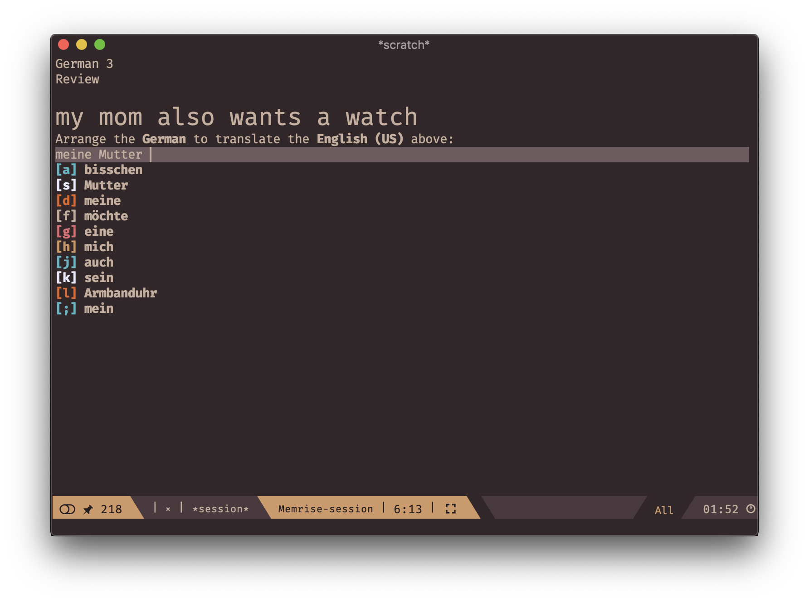
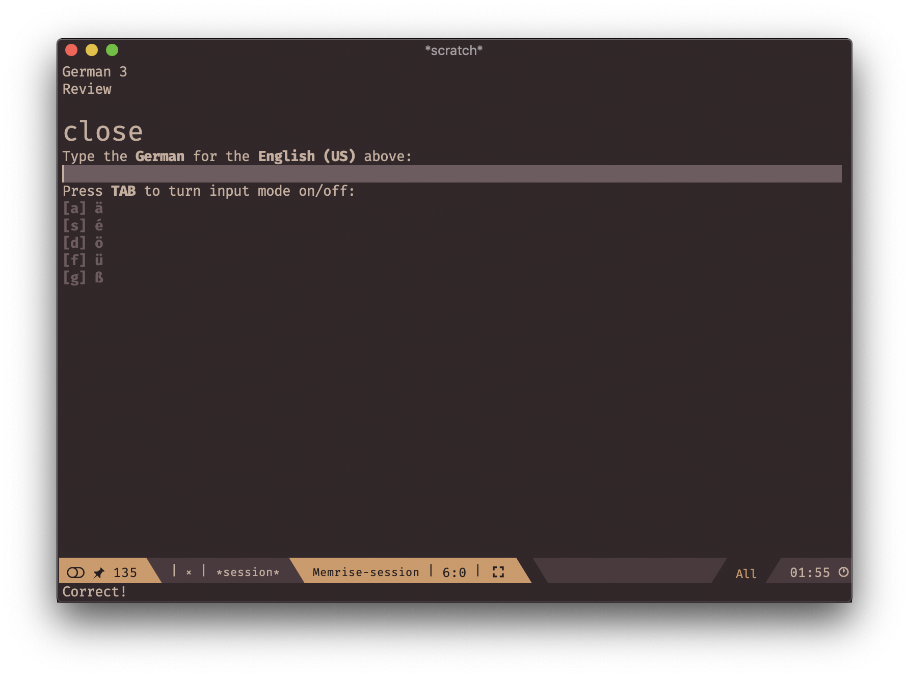

# memrise.el 

## Screenshots

Here it is a few screenshots of differents parts of **memrise.el**

### Dashboard

It summarizes all the courses that the user studies at the moment.

### Tests

In this section you can find screenshots of how **Memrise** tests looks like in **memrise.el**

#### Multi-choice test

In this category of tests, user must pick the only correct version from the given list of options.

#### Audio test

Audio test asks user to pick the right audio for the given word or phrase.

#### Tapping test

Tapping tests are similar to multi-choice tests as they provide a list of words to choose from, but in this case, user has to *compose* the right phrase using available words.

#### Typing test

Typing test is the hardest, it asks user to type in the correct translation. All the required additional symbols are easily accessible.

## Demo

TODO: film a video and put a link here
